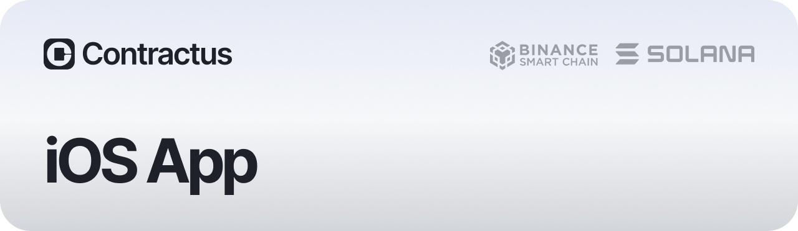

Penning and signing contracts involving considerable sums is a tedious and lengthy process. Contractus facilitates contract signing by vastly accelerating the process and cutting down associated costs.

 - [`Website`](http://contractus.tech/)
 - [`AppStore`](https://apps.apple.com/us/app/contractus-safe-deals/id6462698654)
 - *GooglePlay (Soon)*

`This repository contains the source code of the iOS-application.`

### LICENSING
The primary license for Contractus is the Business Source License 1.1 (BUSL-1.1). see [`LICENSE`](./LICENSE).